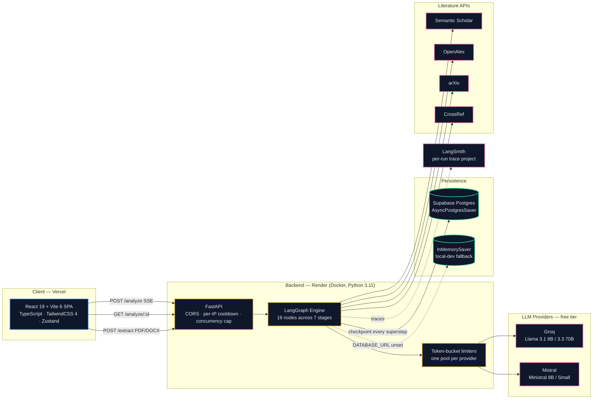
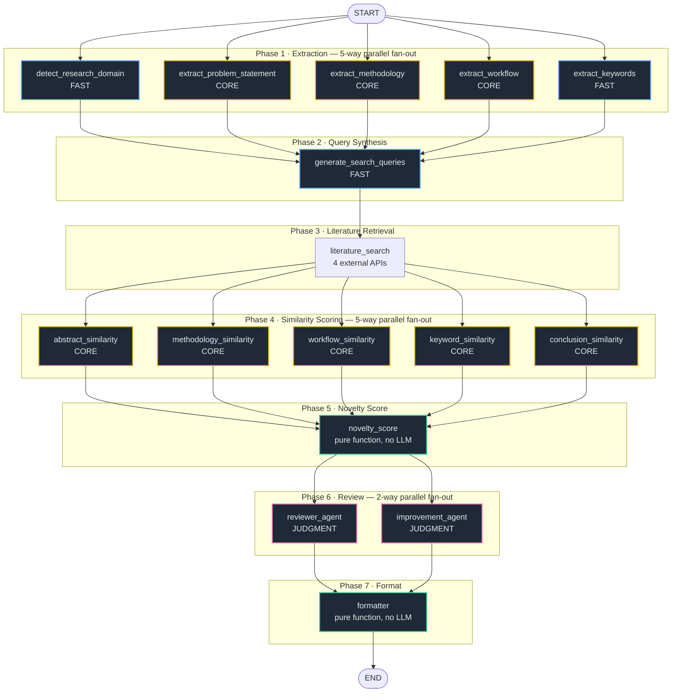
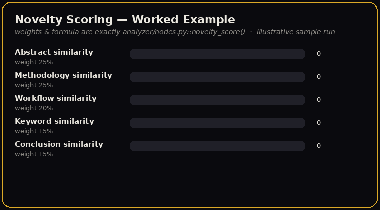
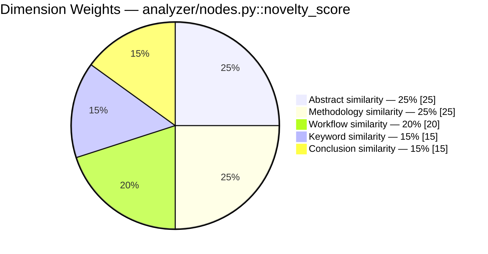
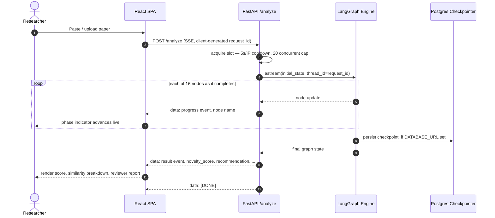
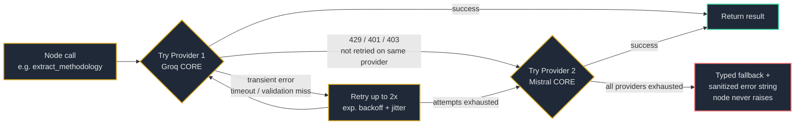
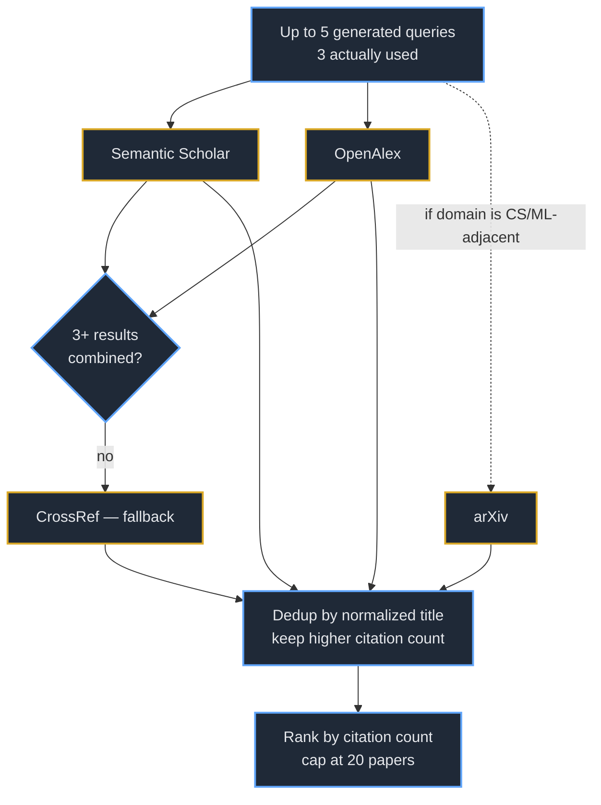

<div align="center">


# Marginal

### An agentic novelty-assessment engine for research papers

Marginal checks a manuscript's originality against live academic literature — Semantic Scholar, OpenAlex, arXiv, and CrossRef — using a 16-node LangGraph pipeline that streams its reasoning back to the browser node-by-node, in real time.

[](https://marginal-theta.vercel.app/)
[](https://marginal-wqys.onrender.com/)


**[Live App](https://marginal-theta.vercel.app/)** · **[API](https://marginal-wqys.onrender.com/)** · **[Features](#-features)** · **[Architecture](#-system-architecture)** · **[The Pipeline](#-the-agentic-pipeline-deep-dive)** · **[Getting Started](#-getting-started)** · **[API Reference](#-api-reference)**

</div>

<br/>



<sub>↑ Illustrative diagram of a live run — the real thing streams these exact stage transitions to the browser over Server-Sent Events. See <a href="#-the-agentic-pipeline-deep-dive">The Agentic Pipeline</a> below for the full 16-node breakdown.</sub>

<br/>
<br/>

## 📊 At a Glance

| | | | |
|---|---|---|---|
| **16** LangGraph nodes | **7** pipeline stages | **4** literature APIs | **2** LLM providers, 4 models |
| **125** backend tests | **84** unit / **41** integration | **5** weighted similarity dimensions | **20** concurrent runs supported |
| **22 RPM** Groq throttle | **12 RPM** Mistral throttle | **20s** per-call LLM timeout | **5s** per-IP cooldown |

*(Every figure above is pulled directly from the source in this repository, not marketing copy — see the sections they link to for exactly where each number comes from.)*

---

## Table of Contents

- [Overview](#overview)
- [Features](#-features)
- [System Architecture](#-system-architecture)
- [The Agentic Pipeline (Deep Dive)](#-the-agentic-pipeline-deep-dive)
- [Resilience and Multi-Provider Strategy](#-resilience-and-multi-provider-strategy)
- [Literature Retrieval Strategy](#-literature-retrieval-strategy)
- [Tech Stack](#-tech-stack)
- [Project Structure](#-project-structure)
- [Getting Started](#-getting-started)
- [Deployment](#-deployment)
- [API Reference](#-api-reference)
- [Testing](#-testing)
- [Performance and Operational Metrics](#-performance-and-operational-metrics)
- [Key Design Decisions](#-key-design-decisions)
- [Security Notes](#-security-notes)
- [Roadmap and Known Limitations](#-roadmap-and-known-limitations)
- [Contributing](#-contributing)
- [License](#-license)

---

## Overview

A researcher pastes in a title, abstract, methodology, and conclusion (or uploads a PDF/DOCX and lets the app extract those fields automatically). Marginal fans that submission out across a 16-node **LangGraph** DAG that runs in parallel wherever the data allows: it classifies the research domain, pulls the paper apart into its structural components, searches four external literature APIs concurrently, scores similarity against the retrieved papers along five independent dimensions, computes a weighted **novelty score**, and produces an LLM-generated peer-review-style report — strengths, weaknesses, a recommendation (`Accept` / `Minor Revision` / `Major Revision` / `Reject`), and concrete improvement suggestions.

Every node update streams to the browser over **Server-Sent Events** the instant it completes, so the UI shows real progress through real pipeline stages — not a spinner.

The backend runs entirely on free-tier LLM inference (Groq + Mistral) behind a custom resilience layer that retries, times out, and fails over between providers automatically, because a project built on free tiers has to take rate limits and outages seriously rather than assume they won't happen.

---

## ✨ Features

**🧠 16-node agentic pipeline** — Extraction, query synthesis, literature retrieval, similarity scoring, novelty computation, review, and formatting run as a single [LangGraph](https://github.com/langchain-ai/langgraph) `StateGraph`, with three separate parallel fan-outs (5-way, 5-way, 2-way) so independent work never waits in line behind unrelated work.

**📡 Real-time streaming UX** — Every completed node is pushed to the client over SSE as `data: {"type":"progress","node":"..."}`; the frontend maps all 16 raw node names into 3 human-readable phases (*Reading the Paper → Scoring Similarity → Assembling the Report*) so the researcher always knows what's happening, never a raw internal node name.

**🔄 Provider-failover resilience** — A custom `@resilient_multi_provider` decorator wraps every LLM call: exponential backoff + jitter within a provider, automatic failover to a second provider on sustained failure, and a guaranteed typed fallback so **no single node can ever crash the run** — even under a full provider outage, the graph still reaches `formatter` and returns a (partially degraded, clearly labeled) report.

**📚 Four-source literature retrieval** — Semantic Scholar and OpenAlex are queried concurrently as the primary pair; arXiv is added only when the detected research domain looks CS/ML-adjacent; CrossRef is a fallback queried only when the primary pair returns fewer than 3 combined results. Results are deduplicated by normalized title (keeping the higher citation count) and ranked by citation count.

**⚖️ Transparent, explainable novelty scoring** — `novelty_score = Σ (100 − similarity) × weight`, computed as a **pure function with no LLM in the loop**, across five weighted dimensions (abstract, methodology, workflow, keywords, conclusion). If a dimension is unavailable, weights are renormalized across whatever *is* available rather than silently zeroing it out.

**📄 PDF/DOCX auto-extraction** — Upload a manuscript; `pypdf` / `python-docx` extract raw text, a lightweight LLM call structures it into `title` / `abstract` / `methodology` / `conclusion`, and the analysis form pre-fills itself.

**💾 Durable, resumable runs** — When `DATABASE_URL` is set, every run is checkpointed to Postgres (Supabase) via `AsyncPostgresSaver` — tables are created automatically on first boot — so `GET /analyze/{id}` resolves indefinitely, even after a backend restart. No `DATABASE_URL`? It falls back to an in-memory checkpointer with a clear log warning instead of crashing.

**🚦 Real, proactive rate limiting** — Token-bucket limiters throttle *before* a request would trip a provider's limit (not react to a 429 after the fact), separately for Groq, Mistral, and Semantic Scholar. A per-IP cooldown and a global concurrency cap protect the backend itself.

**🔭 Full observability** — Every run gets its own isolated LangSmith project (`Marginal_RUN_0`, `Marginal_RUN_1`, …), and the project name is returned to the client in the SSE `result` event — every attempt, retry, and provider fallback is traceable end-to-end.

**🔐 Prompt-injection guarding** — Every LLM prompt that includes user-submitted paper content is prefixed with an explicit instruction to treat that content strictly as data, never as instructions — a deliberate, code-level defense against prompt injection via manuscript text.

---

## 🌐 System Architecture



The frontend never talks to an LLM provider, a literature API, or the database directly — everything funnels through the FastAPI layer, which is the only thing holding API keys and connection strings.

---

## 🧬 The Agentic Pipeline (Deep Dive)

This is the actual compiled `StateGraph` from `backend/analyzer/graph.py` — every node and edge below was extracted by programmatically compiling the graph and reading `get_graph().nodes` / `.edges`, not hand-drawn from memory.



### Phase-by-phase

| Phase | Nodes | Fan-out | What happens |
|---|---|---|---|
| 1 · Extraction | `detect_research_domain`, `extract_problem_statement`, `extract_methodology`, `extract_workflow`, `extract_keywords` | 5-way parallel | Pulls the paper apart into independently-analyzable structural fields |
| 2 · Query Synthesis | `generate_search_queries` | merge node | Turns the extracted fields into up to 5 targeted search queries (3 are actually used, to balance recall against latency) |
| 3 · Literature Retrieval | `literature_search` | sequential | Fans out to Semantic Scholar, OpenAlex, arXiv, and CrossRef per the [source strategy](#-literature-retrieval-strategy) below |
| 4 · Similarity Scoring | `abstract_similarity`, `methodology_similarity`, `workflow_similarity`, `keyword_similarity`, `conclusion_similarity` | 5-way parallel | Each dimension is scored independently against the top retrieved papers |
| 5 · Novelty Score | `novelty_score` | pure function | Weighted aggregation — **no LLM call**, deterministic and auditable |
| 6 · Review | `reviewer_agent`, `improvement_agent` | 2-way parallel | One agent writes the peer-review report; the other writes improvement suggestions — independently, so a failure in one never blocks the other |
| 7 · Format | `formatter` | pure function | Assembles the final Markdown report and structured JSON payload |

### Novelty scoring, worked example

The score is a pure, auditable function — `analyzer/nodes.py::novelty_score()` — with no model call in the loop:

```
novelty_score = Σ (100 − similarity_i) × weight_i     for each available dimension i
```

<div align="center">

</div>



If a dimension's LLM call exhausted every provider and returned `None`, it's dropped and the remaining weights are **renormalized** across whatever dimensions did succeed — a run never silently scores as "more novel" just because one dimension failed to resolve. The `errors` array in the API response says exactly which dimensions were missing and why.

### Request lifecycle (SSE)



If the SSE connection drops mid-run, the frontend falls back to polling `GET /analyze/{request_id}`, which resolves against the same checkpointed state — so a flaky connection doesn't lose a run that's still executing server-side.

---

## 🔄 Resilience and Multi-Provider Strategy

Every LLM-backed node is wrapped in `@resilient_multi_provider`, which tries a **stack** of `(model, rate_limiter)` pairs in order — not a single client with a naive retry loop.

| Tier | Used by | Provider 1 (tried first) | Provider 2 (fallback) |
|---|---|---|---|
| **FAST** | `detect_research_domain`, `extract_keywords`, `generate_search_queries` | Groq `llama-3.1-8b-instant` | Mistral `ministral-8b-latest` |
| **CORE** | `extract_problem_statement`, `extract_methodology`, `extract_workflow`, all 5 similarity nodes | Groq `llama-3.3-70b-versatile` | Mistral `mistral-small-latest` |
| **JUDGMENT** | `reviewer_agent`, `improvement_agent` | Mistral `mistral-small-latest` | Groq `llama-3.3-70b-versatile` |

Notice **JUDGMENT tries Mistral first** — the reverse order of FAST/CORE. The two most judgment-heavy, least-tolerant-of-being-wrong calls are deliberately routed to whichever model tends to reason better per call, with Groq's speed as the fallback rather than the primary.



A few deliberate choices worth calling out:

- **Rate-limit and auth errors are *not* retried against the same provider.** A 429 or a 401/403 won't change on a second attempt — the decorator fails straight through to the next provider (a different rate-limit pool, different credentials) instead of burning the retry budget on something that can't succeed.
- **`max_retries=0` on every LangChain client.** Left at their SDK defaults (Groq retries twice internally, Mistral five times, both with their own backoff), a single unreachable provider could silently stack *SDK-level* retries underneath the app's own retry loop — which is exactly what turned one degraded run into an 81-second stall with zero UI feedback during testing. `resilient_multi_provider` is the only thing that owns retry/backoff now.
- **Every error shown to the user is sanitized.** Internal exception text — hostnames, library names, provider identifiers — is logged server-side but never put in front of the researcher; the UI sees a message like *"a network issue reaching an analysis provider,"* never a raw stack trace.
- **A closure-naming bug shaped how the 5 similarity nodes are built.** They're generated by a factory function (`_make_similarity_node`), and the inner function's `__name__` has to be renamed *before* it's wrapped by the decorator — renaming after meant every similarity node's failure logged as a generic "node failed," making a degraded run impossible to debug. Confirmed against a real (unmocked) provider outage, since the fully-mocked test suite's assertions were too loose to catch it.
- **LangGraph's built-in `RetryPolicy`/`error_handler` was evaluated and rejected.** Testing against `langgraph==1.2.8` showed a failing node with parallel siblings in the same superstep could still crash the whole run even with `error_handler` configured. The fix here is architectural — nodes that catch and retry internally so they *never raise* in the first place — rather than depending on the framework to contain an exception after it's thrown.

---

## 📚 Literature Retrieval Strategy



| Source | When it's queried | Notes |
|---|---|---|
| **Semantic Scholar** | Always, concurrently with OpenAlex | Rate-limited to 30 RPM client-side; retries once on 429 with 2s/4s backoff |
| **OpenAlex** | Always, concurrently with Semantic Scholar | Requires `OPENALEX_API_KEY` — OpenAlex has required a key on every request since Feb 2026; the call is skipped entirely (not attempted-then-failed) if the key is missing |
| **arXiv** | Only if the detected research domain looks CS/ML-adjacent (14 keyword hints, e.g. "machine learning", "nlp", "computer vision") | Avoids spending a request on a corpus unlikely to return anything relevant for e.g. a biology paper |
| **CrossRef** | Only if Semantic Scholar + OpenAlex combined return fewer than 3 papers | Fallback of last resort |

Every source call is individually wrapped so one source failing — timeout, auth error, malformed response — never takes down the whole search; it just contributes zero papers and a sanitized entry in the response's `errors` array. `literature_search_impl` itself **never raises**, consistent with the graceful-degradation contract the rest of the pipeline follows. Final results are deduplicated by normalized title (keeping whichever duplicate has the higher citation count) and capped at 20 papers.

---

## 💻 Tech Stack

<table>
<tr>
<td valign="top" width="50%">

**Frontend**

| | |
|---|---|
| Framework | React 19 + Vite 6 |
| Language | TypeScript |
| Styling | TailwindCSS 4 |
| State | Zustand (+ `persist` middleware) |
| Routing | React Router 7, `ProtectedRoute` guard |
| Forms/validation | React Hook Form + Zod |
| Charts | Recharts |
| Animation | Framer Motion, GSAP, `motion`, `lenis` (smooth scroll) |
| WebGL effects | `ogl` (bespoke landing-page backgrounds) |
| Testing | Vitest + React Testing Library |
| Deployment | Vercel (SPA rewrite to `index.html`) |

</td>
<td valign="top" width="50%">

**Backend**

| | |
|---|---|
| Framework | FastAPI (async, SSE via `StreamingResponse`) |
| Orchestration | LangGraph ≥ 1.2.8 |
| LLM providers | `langchain-groq`, `langchain-mistralai` |
| Validation | Pydantic v2 |
| HTTP client | `httpx.AsyncClient` (shared, one per process) |
| Persistence | `langgraph-checkpoint-postgres` + `psycopg[binary,pool]` |
| File parsing | `pypdf`, `python-docx` |
| Observability | LangSmith (`langsmith` SDK, per-run trace projects) |
| Testing | pytest, pytest-asyncio |
| Runtime | Python 3.11-slim (Docker) |
| Deployment | Render (Docker, Oregon region) |

</td>
</tr>
</table>

---

## 📁 Project Structure

<details>
<summary><strong>Click to expand full tree</strong></summary>

```
Marginal/
├── backend/
│   ├── analyzer/
│   │   ├── main.py            # FastAPI app: /analyze, /analyze/{id}, /extract, /health
│   │   ├── graph.py            # Compiles the 16-node LangGraph StateGraph
│   │   ├── nodes.py            # All 16 node implementations
│   │   ├── state.py             # ResearchPaperState TypedDict + build_initial_state()
│   │   ├── llm_clients.py       # FAST / CORE / JUDGMENT provider tiers
│   │   ├── resilience.py        # @resilient / @resilient_multi_provider decorators
│   │   ├── rate_limit.py        # Token-bucket limiters (Groq, Mistral, Semantic Scholar)
│   │   ├── literature.py        # 4-source literature retrieval, dedup, ranking
│   │   └── extractor.py         # PDF/DOCX to structured fields
│   ├── tests/
│   │   ├── unit/                 # 84 tests, pure logic, mocked providers
│   │   └── integration/          # 41 tests, API + graph wiring
│   ├── Dockerfile
│   ├── requirements.in / requirements.txt
│   └── run_local.py
├── frontend/
│   ├── src/
│   │   ├── pages/                # Home, About, Login, SignUp, Analyze, Analysis, History, Profile
│   │   ├── components/           # AnimatedTabs, CardSwap, GooeyNav, MagicBento, LogoLoop, ...
│   │   │   └── history/          # HistoryList, HistoryStats
│   │   ├── lib/                  # api.ts (SSE client), types.ts, supabase.ts, utils.ts
│   │   ├── store/                # Zustand: auth.ts, history.ts (localStorage-persisted)
│   │   └── App.tsx                # Route table + ProtectedRoute wiring
│   ├── public/
│   │   └── logo.png
│   └── vercel.json
├── docs/
│   ├── architecture.md
│   ├── decisions.md              # 6 Architecture Decision Records
│   ├── backend_devlog.md
│   ├── frontend_devlog.md
│   └── assets/
│       ├── pipeline-live-demo.svg
│       └── novelty-score-demo.gif
└── render.yaml
```

</details>

---

## 🚀 Getting Started

### Prerequisites

- **Node.js** 20+ and npm
- **Python** 3.11+
- Free API keys: [Groq](https://console.groq.com/) and [Mistral](https://console.mistral.ai/) (both required); [OpenAlex](https://openalex.org/) (required as of Feb 2026); Semantic Scholar key (optional, recommended)
- A Postgres connection string if you want persistence — the free [Supabase](https://supabase.com/) tier works well — otherwise the backend runs fine against an in-memory store

### Backend

```bash
cd backend
python -m venv venv
source venv/bin/activate        # Windows: venv\Scripts\activate

pip install -r requirements.txt
cp .env.example .env            # fill in GROQ_API_KEY, MISTRAL_API_KEY, OPENALEX_API_KEY, ...

uvicorn analyzer.main:app --reload --port 8000
```

> `main.py` calls `load_dotenv()` before importing the graph, because the LangChain provider clients read their API keys **at module-import time**. Without it, `cp .env.example .env` alone does nothing and the app fails before Uvicorn even binds the port — which looks like a frontend connection problem but is actually the backend never starting at all.

The API is now live at `http://localhost:8000` — check `http://localhost:8000/health`.

### Frontend

```bash
cd frontend
npm install
cp .env.example .env.local      # set VITE_API_BASE_URL=http://localhost:8000

npm run dev                     # http://localhost:3000
```

### Running tests

```bash
# Backend
cd backend && python -m pytest tests/ -v

# Frontend
cd frontend && npm run test
```

---

## 📦 Deployment

| | Frontend | Backend |
|---|---|---|
| Platform | [Vercel](https://vercel.com/) | [Render](https://render.com/) |
| Config | `frontend/vercel.json` — SPA rewrite, all routes to `/index.html` | `render.yaml` — Docker runtime, Oregon region, free plan |
| Build | `vite build` | `Dockerfile` → `python:3.11-slim` |
| Health check | — | `GET /health`, `autoDeploy: true` |

**Backend environment variables** (from `render.yaml` / `backend/.env.example`):

`GROQ_API_KEY` · `MISTRAL_API_KEY` · `OPENALEX_API_KEY` · `SEMANTIC_SCHOLAR_KEY` · `CONTACT_EMAIL` · `ALLOWED_ORIGINS` · `DATABASE_URL` (Supabase **Transaction pooler**, port 6543, for serverless-friendly connections) · `LANGCHAIN_TRACING_V2` · `LANGCHAIN_ENDPOINT` · `LANGCHAIN_API_KEY` · `LANGCHAIN_PROJECT`

**Frontend environment variables**: `VITE_API_BASE_URL` — points at the Render service URL in production.

---

## 📖 API Reference

Base URL: `https://marginal-wqys.onrender.com`

| Method | Path | Description |
|---|---|---|
| `POST` | `/analyze` | Runs a fresh analysis, streamed as SSE |
| `GET` | `/analyze/{request_id}` | Re-fetches a completed (or in-progress) analysis |
| `POST` | `/extract` | Uploads a `.pdf` or `.docx`, returns structured fields |
| `GET` | `/health` | Liveness check, returns `{"status": "ok"}` |

<details>
<summary><strong>POST /analyze — request & SSE response</strong></summary>

<br/>

**Request body**

```jsonc
{
  "title": "string, more than 3 chars, up to 300 chars",
  "abstract": "string, at least 40 chars, up to 4000 chars",
  "workflow": "string, up to 5000 chars (optional, default empty)",
  "conclusion": "string, up to 4000 chars (optional, default empty)",
  "request_id": "optional client-generated ID, reused so a later GET resolves to this run",
  "user_email": "optional string"
}
```

**Response** — `text/event-stream`, one event per completed node, then a final result:

```
data: {"type":"progress","node":"detect_research_domain"}

data: {"type":"progress","node":"extract_problem_statement"}

... one event per node, 16 total ...

data: {"type":"result","request_id":"...","status":"completed","novelty_score":80.05,
       "recommendation":"Accept","strengths":[...],"weaknesses":[...],
       "reviewer_comments":"...","improvement_suggestions":"...",
       "similar_papers":[...],
       "similarity_breakdown":{
         "abstract":{"score":20,"rationale":"..."},
         "methodology":{"score":22,"rationale":"..."},
         "workflow":{"score":15,"rationale":"..."},
         "keyword":{"score":25,"rationale":"..."},
         "conclusion":{"score":18,"rationale":"..."}
       },
       "errors":[], "langsmith_project":"Marginal_RUN_42"}

data: [DONE]
```

- `429` — per-IP cooldown not yet elapsed (5s)
- `503` — global concurrency cap reached (20 concurrent runs)

</details>

<details>
<summary><strong>POST /extract</strong></summary>

<br/>

Multipart file upload, `.pdf` or `.docx` only.

```jsonc
// 200 OK
{ "title": "...", "abstract": "...", "methodology": "...", "conclusion": "..." }
```

Falls back to an empty-string shape (rather than an error) if the structuring LLM call fails on every provider — a partial extraction beats a hard failure for a UX whose whole point is saving the user typing.

</details>

---

## 🧪 Testing

| Layer | Files | Tests | What's covered |
|---|---|---|---|
| Backend — unit | 9 files | 84 | Pure logic in isolation: extractor, literature helpers, LLM client wiring, novelty/formatter math, rate limiter, resilience decorators, state builder |
| Backend — integration | 5 files | 41 | `/analyze`, `/extract` over real ASGI requests; full graph pipeline wiring; live-shaped literature source responses |
| Frontend | 3 files | 7 | `FeatureSteps`, the SSE-consuming `api.ts` client, `Analyze` page |

```bash
cd backend && python -m pytest tests/ -v --cov=analyzer
cd frontend && npm run test
```

The backend suite is designed around **mocked providers everywhere, except integration tests that explicitly target real-shaped API responses**, so tests stay fast and don't burn free-tier LLM/API quota on every run. Rate limiting, retries, and provider fallback all have dedicated unit tests rather than being exercised only incidentally through end-to-end runs.

---

## 📈 Performance and Operational Metrics

All figures below are literal constants read from the source, not estimates.

| Metric | Value | Source |
|---|---|---|
| Groq throttle | 22 requests/min (token bucket) | `rate_limit.py` — conservative vs. Groq's documented ~30 RPM org-wide |
| Mistral throttle | 12 requests/min (token bucket) | `rate_limit.py` — Mistral's free tier doesn't publish an exact number |
| Semantic Scholar throttle | 30 requests/min (token bucket) | `rate_limit.py` — vs. their documented 1 req/sec |
| Per-call LLM timeout | 20 seconds | `llm_clients.py` — explicit on every client, not left to SDK defaults |
| Retries per provider | 2 attempts, exponential backoff + jitter | `resilience.py` |
| Global concurrency cap | 20 simultaneous runs | `main.py` |
| Per-IP cooldown | 5 seconds | `main.py` |
| Literature results cap | 20 papers, post-dedup | `literature.py` |
| Fallback trigger | fewer than 3 combined primary results | `literature.py` |
| Search queries used | 3 of up to 5 generated | `literature.py` — recall vs. latency tradeoff |
| Per-source result limit | 15 papers | `literature.py` |
| External request timeout | 10 seconds | `literature.py` |

---

## 🎯 Key Design Decisions

Condensed from `docs/decisions.md` (6 ADRs):

| # | Decision | Why |
|---|---|---|
| 1 | LangGraph for orchestration | Multi-step evaluation as a clear DAG, easy parallel fan-out, native progress streaming |
| 2 | SSE over WebSockets | Natively browser-supported, unidirectional fits the use case, simpler to scale |
| 3 | Custom `@resilient_multi_provider` decorator | Transparent cross-provider failover without littering every node with try/except |
| 4 | Removed email notifications | SMTP sender-identity verification proved unreliable — an immediate in-browser result beats a flaky email |
| 5 | PDF/DOCX auto-extraction | Users don't want to hand-copy manuscript text into a web form |
| 6 | Vitest over Jest for frontend tests | Native Vite integration, faster startup, first-class TypeScript support |

One deliberate non-decision worth knowing about: LangGraph's built-in `RetryPolicy`/`error_handler` was evaluated and **rejected** — see [Resilience and Multi-Provider Strategy](#-resilience-and-multi-provider-strategy) above for why.

---

## 🔒 Security Notes

- **Prompt-injection guarding.** Every LLM call that includes user-submitted paper text is prefixed with an explicit system instruction to treat that content as data to analyze, never as instructions to follow — applied consistently across extraction, review, and improvement-suggestion nodes.
- **Sanitized error surfaces.** Raw exception text (hostnames, provider/library names, stack details) is logged server-side only; API responses and the UI only ever see a generic, categorized message.
- **Current auth is a frontend-only demo, not an access-control boundary.** `Login`/`SignUp` write directly to a Zustand store persisted in `localStorage` — there is no call to Supabase Auth (a client is configured in `lib/supabase.ts` but not currently wired up), and the backend's `/analyze`, `/extract`, and `/analyze/{id}` routes have no auth dependency at all. `ProtectedRoute` gates client-side navigation only; the API itself is fully public today. Worth knowing before treating this as a deployment with real user isolation.
- **CORS is configurable, not wide-open by default in production.** `ALLOWED_ORIGINS` restricts accepted origins; it only falls back to `*` when unset, which is intended for local development.

---

## 🧭 Roadmap and Known Limitations

- **Rate limiting is in-process.** The per-IP cooldown and concurrency cap live in a single Python process's memory — correct for exactly one backend instance. Horizontal scaling would need a Redis-backed implementation instead.
- **No CI workflow yet.** Tests are comprehensive but currently run manually (`pytest`, `npm run test`) rather than gated on push/PR.
- **No license file.** All rights are reserved by default until one is added — MIT or Apache-2.0 would be typical choices for a project at this stage.
- **Real authentication.** Wiring the already-installed `@supabase/supabase-js` client up to actual Supabase Auth, and adding a real auth dependency to the FastAPI routes, is the natural next step — see [Security Notes](#-security-notes).
- **In-memory fallback has no persistence warning surfaced to the end user.** It logs server-side, but a researcher running against a `DATABASE_URL`-less deployment has no way to know their run won't survive a restart.

---

## 🤝 Contributing

There's no `CONTRIBUTING.md` yet, but the shape of the codebase makes the pattern clear. To add a new pipeline node:

1. Add the node function to `analyzer/nodes.py`, wrapped in `@resilient` or `@resilient_multi_provider` with an explicit typed `fallback`.
2. Register it in `analyzer/graph.py` — add it to the relevant node-group tuple (`EXTRACTION_NODES`, `SIMILARITY_NODES`, `REVIEW_NODES`) or wire its edges directly if it doesn't fit an existing fan-out.
3. Add both a unit test (mocked provider) and, if it changes the graph's shape, an integration test against `tests/integration/test_graph_pipeline.py`.
4. If it adds a new field to the API response, update `_build_analysis_payload()` in `main.py` and the corresponding TypeScript type in `frontend/src/lib/types.ts`.

## 📄 License

No `LICENSE` file is currently included in this repository. Until one is added, all rights are reserved by default under standard copyright law.

---

<div align="center">

<sub>Built with LangGraph, FastAPI, and React · Runs entirely on free-tier infrastructure</sub>

</div>
