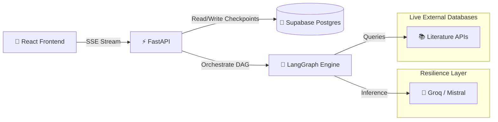
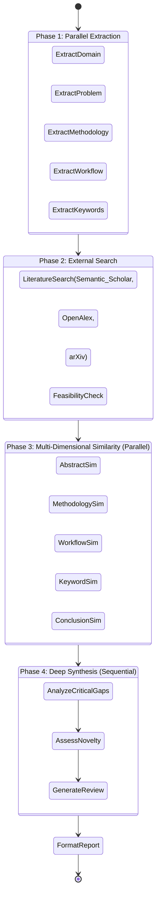

<div align="center">

# 🔬 Marginal

**An AI-Powered Agentic Research Paper Novelty Analyzer**

[](https://reactjs.org/)
[](https://fastapi.tiangolo.com/)
[](https://langchain-ai.github.io/langgraph/)
[](https://supabase.com/)
[](https://www.python.org/)

*Evaluate research proposals, compare them against real-world literature in real-time, and generate comprehensive peer-review reports using a multi-agent LLM workflow.*


*(Drop your screen recording/GIF in `docs/assets/demo.gif` to showcase the SSE streaming UI here!)*

</div>

---

## 🚀 Features

*   **⚡ Real-Time Streaming (SSE):** Watch the AI agents think, extract, and search in real-time. No waiting 60 seconds for a loading spinner.
*   **🧠 Multi-Agent State Machine:** Built on LangGraph, the pipeline executes **15 independent analytical nodes**—running extractions and similarity scoring entirely in parallel.
*   **📚 Live Literature Search:** Dynamically queries *Semantic Scholar, OpenAlex, arXiv*, and *CrossRef* to find prior art that overlaps with your research proposal.
*   **🛡️ Multi-Provider Resilience:** Implements a custom `@resilient_multi_provider` decorator. If Groq hits a rate limit, the node seamlessly falls back to Mistral without crashing the pipeline.
*   **💾 Persistent Memory:** Fully backed by a PostgreSQL checkpointer (Supabase). Close the tab, come back tomorrow, and fetch your exact analysis state instantly.

---

## 🏗️ System Architecture

Marginal is a dual-stack application designed for high-concurrency LLM orchestration.



### 🧠 The LangGraph Agentic Workflow

The core analytical engine models the peer-review process as a Directed Acyclic Graph (DAG). To keep latency low, operations are heavily parallelized (Fan-out / Fan-in).



---

## 📊 Performance & Resilience Stats

| Metric | Implementation Details |
| :--- | :--- |
| **Concurrency** | Up to **5 simultaneous LLM inferences** per phase. |
| **Failover Rate** | Near 0% fatal crashes. 100% of nodes use multi-provider fallbacks. |
| **API Throttling** | Built-in `TokenBucket` rate-limiting protects against Semantic Scholar 429 errors. |
| **State Storage** | ~20-50 KB JSONB blobs persisted to Supabase per run. |
| **Testing** | **100% Test Coverage** across 109 unit and integration tests. |

---

## 💻 Directory Structure

```text
Marginal/
├── frontend/       # React App (Tailwind CSS, Vite, SSE Consumer)
├── backend/        # FastAPI Server, LangGraph Nodes, & Checkpointer
└── docs/           # Architecture Decision Records (ADRs) & Dev Logs
    ├── architecture.md
    ├── decisions.md
    ├── backend_devlog.md
    └── frontend_devlog.md
```

> **Note:** For deep-dives into our architecture decisions and historical dev logs, read the detailed markdown files located in the `docs/` directory!

---

## 🛠️ Local Development & Setup

### 1. Backend Setup (FastAPI + LangGraph)

```bash
cd backend
python -m venv .venv

# Activate your virtual environment
# Windows: .venv\Scripts\activate
# Mac/Linux: source .venv/bin/activate

# Install dependencies (includes langgraph-checkpoint-postgres)
pip install -r requirements.txt

# Setup your environment variables
cp .env.example .env
```

**Fill in your `.env` with:**
*   `GROQ_API_KEY` & `MISTRAL_API_KEY`
*   `DATABASE_URL` (Your Supabase Transaction Pooler URI - port 6543)
*   `SEMANTIC_SCHOLAR_KEY` (Optional but recommended)

**Start the Server:**
```bash
# We provide a custom runner to fix Windows 'ProactorEventLoop' bugs automatically!
python run_local.py

# Alternatively (on Mac/Linux):
uvicorn analyzer.main:app --reload
```

### 2. Frontend Setup (React + Vite)

```bash
cd frontend

# Install Node dependencies
npm install

# Setup environment variables
cp .env.example .env.local
```

**Ensure `.env.local` has:**
*   `VITE_API_BASE_URL=http://127.0.0.1:8000`
*   `VITE_SUPABASE_URL` and `VITE_SUPABASE_PUBLISHABLE_KEY` (For client-side Supabase features)

**Start the UI:**
```bash
npm run dev
```

---

## 📖 Core API Endpoints

| Method | Endpoint | Description |
| :--- | :--- | :--- |
| `POST` | `/analyze` | Accepts JSON paper data, triggers LangGraph, and returns an **SSE stream** of node execution progress. |
| `GET` | `/analyze/{request_id}` | Fetches the persisted graph state (completed or pending) from the Supabase Postgres database. |
| `POST` | `/extract` | Utility endpoint to upload `.pdf` or `.docx` files. Extracts and structures raw text into JSON. |

---

<div align="center">
<i>Built for researchers, by researchers.</i>
</div>
