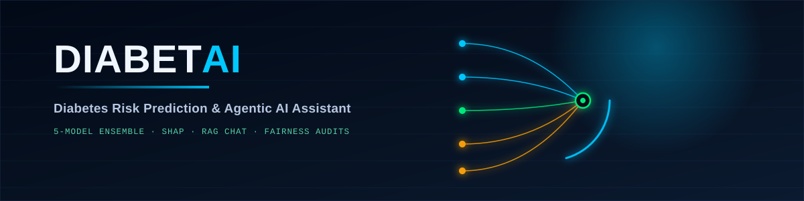
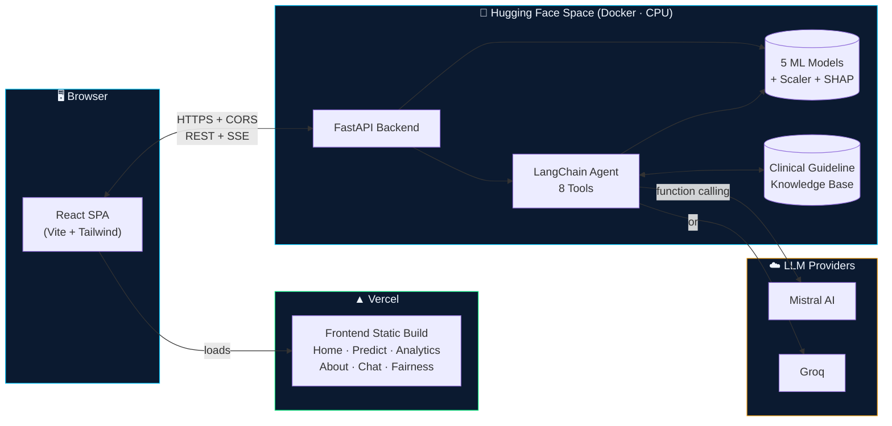
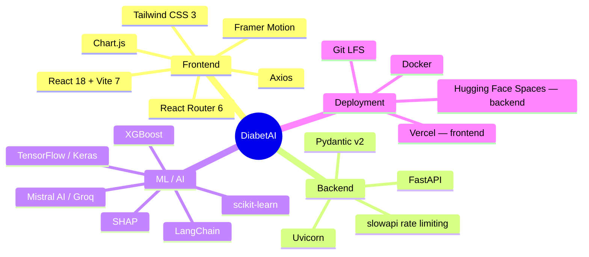
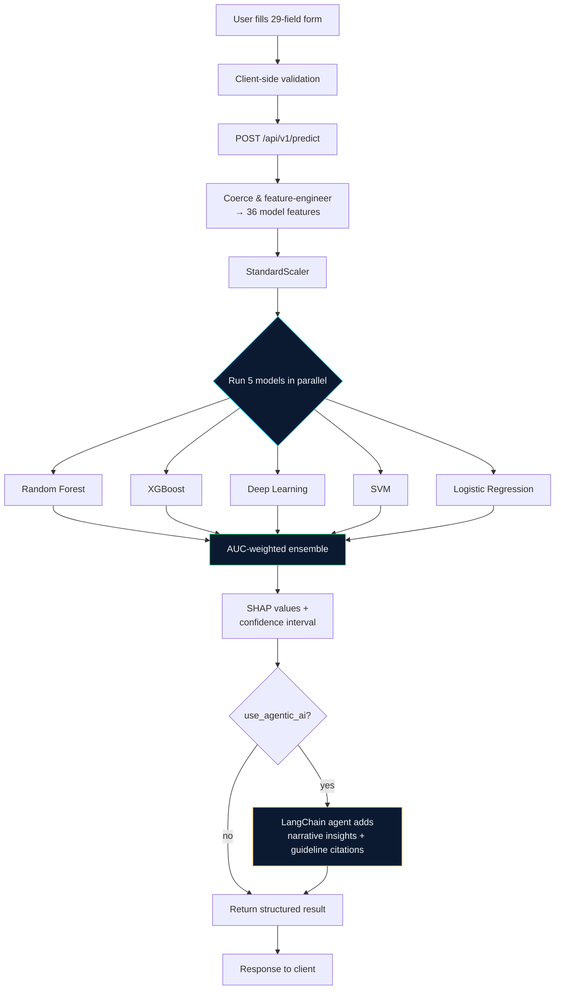
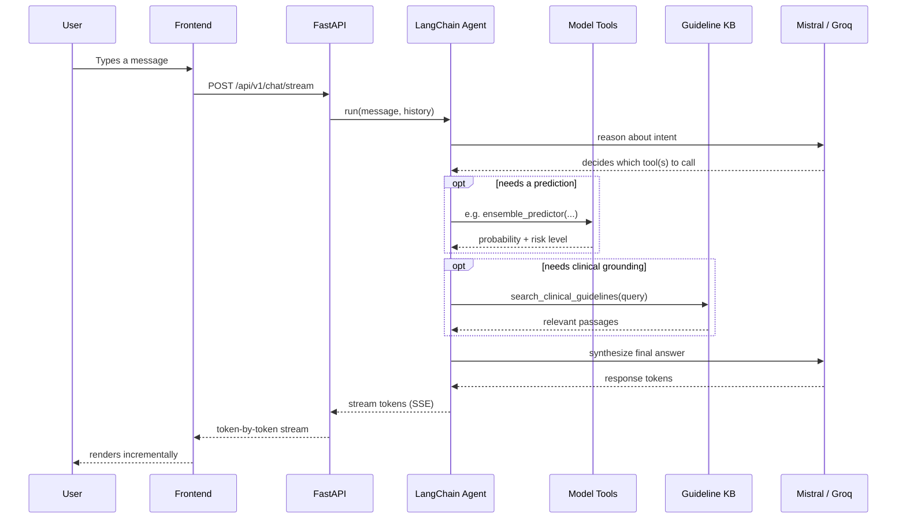
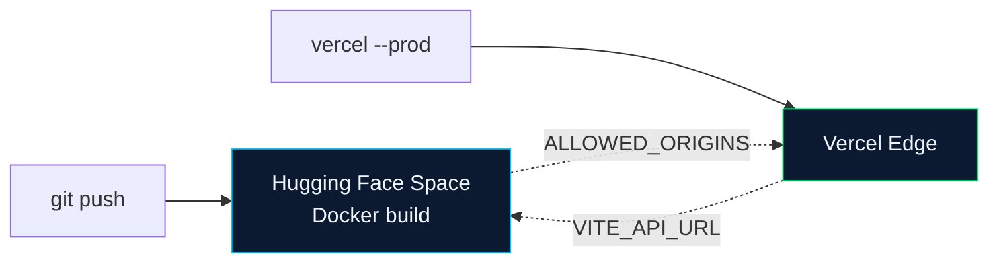

<div align="center">



<br/>

[](https://diabete-ai-agentic-ml-deep-learing.vercel.app/)
[](https://huggingface.co/spaces/RaGaS111/DiabetesBackendAI)
[](#-license)

**A full-stack diabetes risk prediction system** — a 5-model ML ensemble with SHAP explainability, a LangChain agent that can reason with those models as tools, a RAG-grounded chat interface, and a counterfactual fairness audit dashboard.

[Live App](https://diabete-ai-agentic-ml-deep-learing.vercel.app/) · [API Docs](https://ragas111-diabetesbackendai.hf.space/docs) · [Deployment Guide](./DEPLOYMENT.md) · [Report a Bug](#-contributing)

</div>

<br/>

> [!IMPORTANT]
> **This is a portfolio/research project, not a medical device.** Predictions are for educational and demonstration purposes only, are not a substitute for professional medical advice, diagnosis, or treatment, and should never be used to make real clinical decisions. Always consult a qualified healthcare provider for anything related to your actual health.

<br/>

## 📋 Table of Contents

- [Overview](#-overview)
- [System Architecture](#-system-architecture)
- [Screenshots](#-screenshots)
- [Features](#-features)
- [Tech Stack](#️-tech-stack)
- [How a Prediction Works](#-how-a-prediction-works)
- [Agentic Chat Flow](#-agentic-chat-flow)
- [Project Structure](#-project-structure)
- [API Reference](#-api-reference)
- [Frontend Pages](#-frontend-pages)
- [Model Performance](#-model-performance)
- [Getting Started](#-getting-started)
- [Deployment](#-deployment)
- [Security & Privacy](#-security--privacy)
- [Contributing](#-contributing)
- [License](#-license)

<br/>

## 🎯 Overview

DiabetAI takes 29 patient-reported fields (demographics, lifestyle, medical history, vitals, and lab values), engineers them into 36 model features, and runs them through five independently-trained classifiers whose outputs are combined into a single AUC-weighted ensemble score. On top of that sits a LangChain agent that can call each model as a tool, pull relevant passages from a clinical guideline knowledge base (RAG), and explain *why* the model thinks what it thinks — backed by real SHAP values, not just LLM narration.

| | |
|---|---|
| 🧠 **5 ML models** | Random Forest · XGBoost · Deep Learning (Keras) · SVM · Logistic Regression, combined into a weighted ensemble |
| 🔍 **Explainability** | SHAP values + confidence intervals on every prediction, not just a bare probability |
| 💬 **Agentic chat** | LangChain agent with 8 tools, streaming responses, RAG-grounded clinical citations |
| ⚖️ **Fairness audits** | Counterfactual disparity analysis across gender, ethnicity, age, and BMI category |
| 📊 **Live analytics** | Trends, feature importance, and risk distribution dashboards |

<br/>

## 🏗 System Architecture



Frontend and backend deploy and scale independently — the frontend is a static Vite build served from Vercel's edge network, and the backend is a single Dockerized FastAPI service on a Hugging Face Space. They only ever talk over plain HTTPS (REST for most endpoints, Server-Sent Events for streaming chat), gated by an explicit CORS allow-list.

<br/>

## 📸 Screenshots

> Add real screenshots or a short screen recording (GIF) of the app here — e.g. the Prediction results panel, the Analytics dashboard, and the Chat interface tend to show best. A quick way: [Kap](https://getkap.co/) (Mac), [ScreenToGif](https://www.screentogif.com/) (Windows), or [Peek](https://github.com/phw/peek) (Linux) → drop the `.gif` in `assets/` → reference it below.

```markdown


```

<br/>

## ✨ Features

### Backend
- **Multi-model ensemble** — 5 independently-trained classifiers, weighted by real held-out AUC-ROC
- **Agentic AI** — LangChain agent with the models exposed as callable tools, not just a chat wrapper around one LLM call
- **Streaming chat** — token-by-token SSE responses with structured metadata (dashboards, extracted patient data) sent inline
- **RAG-grounded answers** — clinical guideline retrieval backs the agent's citations, not free-form LLM claims
- **SHAP explainability** — real feature-attribution values for tree-based models, on every prediction
- **Fairness auditing** — counterfactual analysis (clone 200 patients, vary only one demographic attribute) across 4 dimensions
- **PDF report generation** — downloadable per-prediction report
- **Rate limiting** — tiered limits per endpoint (`slowapi`), configurable API-key auth
- **Smart caching** *(frontend-side)* — read-only endpoints cached client-side with sensible TTLs, never predictions or chat

### Frontend
- **Route-level code splitting** — each page loads on demand; Chart.js only ships to users who visit Analytics
- **Optimistic, skeleton-first UI** — shape-matched loading states instead of blocking spinners, stale-while-revalidate on data refresh
- **Interactive risk gauge & SHAP panel** — custom SVG visualizations, not generic chart-library defaults
- **Streaming chat UI** — token-by-token rendering with scroll-position-aware auto-follow
- **Fully responsive** — mobile-first, tested down to small phone widths
- **Dark theme** — custom design system (see `tailwind.config.js`)

<br/>

## 🛠️ Tech Stack



<details>
<summary><strong>Full dependency versions</strong></summary>

**Backend**
| Library | Version |
|---|---|
| FastAPI | `>=0.109.0,<1.0.0` |
| Uvicorn | `>=0.27.0` |
| LangChain | `0.3.30` |
| langchain-mistralai | `0.2.12` |
| langchain-groq | `0.3.8` |
| scikit-learn | `1.6.1` |
| XGBoost | `2.0.3` |
| TensorFlow | `2.16.1` |
| SHAP | `>=0.44.0` |

**Frontend**
| Library | Version |
|---|---|
| React | `^18.2.0` |
| React Router DOM | `^6.21.1` |
| Vite | `^7.3.5` |
| Tailwind CSS | `^3.4.1` |
| Framer Motion | `^10.18.0` |
| Chart.js / react-chartjs-2 | `^4.4.1` / `^5.2.0` |
| Axios | `^1.6.5` |
| Lenis (smooth scroll) | `^1.0.42` |
| lucide-react | `^0.309.0` |

</details>

<br/>

## 🔬 How a Prediction Works



<br/>

## 💬 Agentic Chat Flow



<br/>

## 📁 Project Structure

```
diabetes-prediction-system/
├── colab-notebooks/
│   └── diabetes_model_training.ipynb   # Model training pipeline
├── backend/
│   ├── app/
│   │   ├── api/            # health, predictions, analytics, chat, report, fairness
│   │   ├── core/           # config, rate limiter
│   │   ├── schemas/        # Pydantic request/response models
│   │   └── services/       # model_loader, agentic_ai, fairness, etc.
│   ├── trained_models/     # .pkl / .keras models — Git LFS tracked
│   ├── main.py             # FastAPI app, middleware, lifespan
│   ├── requirements.txt
│   ├── Dockerfile
│   └── README.md           # Hugging Face Space card
├── frontend/
│   ├── src/
│   │   ├── components/     # Navigation, Footer, Hero, RouteFallback
│   │   ├── pages/          # Home, Prediction, Analytics, About, Chat, Fairness
│   │   ├── services/       # api.js — backend client
│   │   ├── utils/          # requestCache.js
│   │   ├── styles/
│   │   └── routes.js       # single source of truth for lazy routes
│   ├── package.json
│   ├── vite.config.js
│   ├── vercel.json         # SPA rewrite rule
│   └── tailwind.config.js
├── DEPLOYMENT.md           # full deploy walkthrough, incl. Git LFS gotchas
└── QUICKSTART.md
```

<br/>

## 📡 API Reference

Base URL: `https://ragas111-diabetesbackendai.hf.space/api/v1` · Interactive docs at [`/docs`](https://ragas111-diabetesbackendai.hf.space/docs)

<details open>
<summary><strong>Prediction</strong></summary>

| Method | Endpoint | Description |
|---|---|---|
| `POST` | `/predict` | Single prediction — 5 models + ensemble + SHAP + optional agentic insights |
| `POST` | `/batch-predict` | Multiple patients in one request |
| `GET` | `/models` | List loaded models, AUC weights, SHAP availability |

</details>

<details>
<summary><strong>Analytics</strong></summary>

| Method | Endpoint | Description |
|---|---|---|
| `POST` | `/analytics` | Aggregate stats for a time range |
| `GET` | `/analytics/trends` | Daily prediction volume & positive rate |
| `GET` | `/analytics/feature-importance` | Real importances from XGBoost + RF |
| `GET` | `/analytics/risk-factors` | Top contributing risk factors |

</details>

<details>
<summary><strong>Chat</strong></summary>

| Method | Endpoint | Description |
|---|---|---|
| `POST` | `/chat` | Single-turn agentic response (non-streaming) |
| `POST` | `/chat/stream` | Token-by-token SSE stream |
| `GET` | `/chat/suggested-prompts` | Starter prompts for the UI |

</details>

<details>
<summary><strong>Fairness</strong></summary>

| Method | Endpoint | Description |
|---|---|---|
| `GET` | `/fairness` | Full counterfactual audit report |
| `GET` | `/fairness/summary` | High-level summary only |
| `GET` | `/fairness/dimension/{name}` | Single dimension (gender/ethnicity/age_group/bmi_category) |
| `POST` | `/fairness/refresh` | Trigger a fresh audit run |

</details>

<details>
<summary><strong>Reports & Health</strong></summary>

| Method | Endpoint | Description |
|---|---|---|
| `GET` | `/report/{prediction_id}` | Download a prediction as PDF |
| `POST` | `/report/generate` | Generate a report on demand |
| `GET` | `/health` | Basic liveness check |
| `GET` | `/health/detailed` | Per-model load status, incl. `deep_learning` diagnostics |

</details>

<br/>

## 🎨 Frontend Pages

| Page | Route | Description |
|---|---|---|
| Home | `/` | Hero, live stat ticker, model benchmark table |
| Predict | `/prediction` | 29-field form → risk gauge, SHAP panel, confidence interval |
| Analytics | `/analytics` | Trends, model performance, feature importance charts |
| Chat | `/chat` | Streaming conversation with the agentic assistant |
| Fairness | `/fairness` | Counterfactual disparity audit across 4 demographic dimensions |
| About | `/about` | Project & technology overview |

<br/>

## 📈 Model Performance

Real held-out test-set AUC-ROC — these are the exact weights the ensemble uses, pulled live from `/api/v1/models`:

| Model | AUC-ROC |
|---|---|
| 🥇 XGBoost | `0.9437` |
| 🥈 Deep Learning | `0.9432` |
| 🥉 Random Forest | `0.9432` |
| Logistic Regression | `0.9339` |
| SVM | `0.9338` |

```
XGBoost              ████████████████████░  0.9437
Deep Learning         ███████████████████░  0.9432
Random Forest         ███████████████████░  0.9432
Logistic Regression   ██████████████████░░  0.9339
SVM                   ██████████████████░░  0.9338
```

All five sit within ~1 point of each other — which is exactly why this is an *ensemble* rather than a single best-model pick, and why the deep learning model earns its place despite adding real deployment complexity (see [DEPLOYMENT.md](./DEPLOYMENT.md) for that whole story).

<br/>

## 🚀 Getting Started

### Prerequisites
- Python 3.10+ and Node.js 18+
- A [Mistral](https://console.mistral.ai/) or [Groq](https://console.groq.com/) API key (free tier works)
- Trained model files in `backend/trained_models/` — either train your own via `colab-notebooks/diabetes_model_training.ipynb`, or bring your own `.pkl`/`.keras` files matching the schema in `app/schemas/prediction.py`

### Backend
```bash
cd backend
pip install -r requirements.txt
cp .env.example .env
```
Edit `.env`:
```env
MISTRAL_API_KEY=your_key_here
# or GROQ_API_KEY=your_key_here
PRIMARY_LLM=mistral
ALLOWED_ORIGINS=http://localhost:5173
```
```bash
python main.py
```
→ API at `http://localhost:7860`, docs at `http://localhost:7860/docs`

### Frontend
```bash
cd frontend
npm install
cp .env.example .env   # set VITE_API_URL=http://localhost:7860
npm run dev
```
→ App at `http://localhost:5173`

<br/>

## ☁️ Deployment

**Live right now:** frontend on [Vercel](https://diabete-ai-agentic-ml-deep-learing.vercel.app/), backend on a [Hugging Face Space](https://huggingface.co/spaces/RaGaS111/DiabetesBackendAI) (Docker SDK, CPU).

The short version:



Full step-by-step instructions — including two things that will genuinely trip you up if you don't know about them going in — are in **[DEPLOYMENT.md](./DEPLOYMENT.md)**:

> [!WARNING]
> **Git LFS is not optional.** Any model file over 10MB (this project's `random_forest.pkl` is ~29MB) gets flatly rejected by Hugging Face's git server unless it's tracked with `git lfs track` *before* the first commit that adds it.

> [!NOTE]
> Hugging Face's Docker SDK started requiring a paid plan for **newly created** Spaces. Existing Spaces created before that change keep working on the free CPU tier — reusing one, as this project does, is a straightforward way around it if you have one available.

<br/>

## 🔒 Security & Privacy

- Predictions are not persisted by default (optional local JSONL logging only, off by default)
- CORS is an explicit origin allow-list, no wildcards
- Optional `X-API-Key` header auth via `API_KEY_SECRET`
- Tiered rate limiting per endpoint class
- Input validation via Pydantic on every request

This project is **not** HIPAA-certified or audited for clinical use — treat the above as sound engineering practice for a public demo, not a compliance claim.

<br/>

## 🤝 Contributing

Contributions are welcome:
1. Fork the repository
2. Create a feature branch
3. Commit your changes
4. Open a Pull Request

<br/>

## 📝 License

MIT — this repo doesn't yet include a `LICENSE` file; add one (e.g. via [choosealicense.com](https://choosealicense.com/licenses/mit/)) to make it official.

<br/>

## 🎉 Acknowledgments

- ML: scikit-learn, XGBoost, TensorFlow/Keras, SHAP
- Agentic AI: LangChain, Mistral AI, Groq
- Frontend: React, Framer Motion, Chart.js, Lucide

<div align="center">

**Made for learning how far a "simple" ML demo can be pushed.**

</div>
